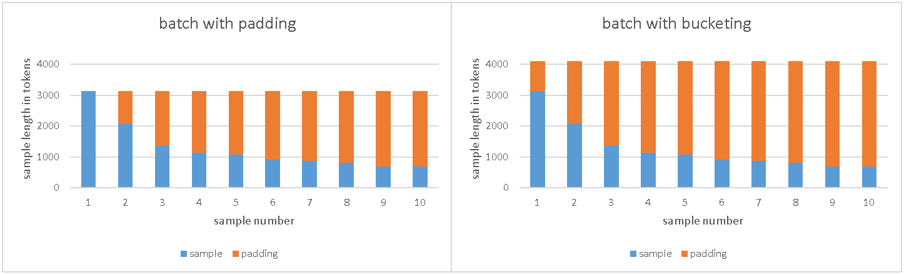

# InstructLab Training on HPU

## HPU specific changes
Next changes are required to enable training on HPU:

|GPU|HPU|
|---|---|
|`from accelerate import Accelerator` | `from optimum.habana.accelerate import GaudiAccelerator`|
|`from accelerate.utils import FullyShardedDataParallelPlugin` | `from optimum.habana.accelerate.utils import GaudiFullyShardedDataParallelPlugin` |

It is also recommended to use HPU optimized versions of transformers:

```Python
from optimum.habana.transformers.modeling_utils import adapt_transformers_to_gaudi
adapt_transformers_to_gaudi()
```

## Bucketing
Multipack sampler implementation produces wide range of batches with different sample lengths and number of samples. Each of these combinations leads to graph recompilation and this recompilation takes time and slows down training. To reduce number of recompilations HPU implementation uses bucketing approach, when maximum sample length in batch is aligned to some predefined value. It is similar to padding but all samples in the batch are padded not to the longest sample but to the some slightly bigger value.




To compute bucked size, we use next algorithm: 
- Firstly, we find MSB of the longest sample in the batch, let's call it S.
- Then we slice the range [2 ** S, 2 ** (S+1)] into 16 buckets of the same size.
- Then we use top boundary of the smallest suitable bucked as padding value.

This approach limits overhead of the bucketing to 1/16 th of the longest sample and allows us to significantly reduce number of recompilations.

## How to run
To run training build docker using next dockerfile:
```Dockerfile
FROM vault.habana.ai/gaudi-docker/1.21.0/rhel9.4/habanalabs/pytorch-installer-2.6.0:1.21.0-555

ARG CMAKE_ARGS="-DGGML_NATIVE=off"

WORKDIR /app
RUN pip install git+https://github.com/instructlab/instructlab.git@v0.26.1

WORKDIR /app
RUN pip install git+https://github.com/huggingface/optimum-habana.git@v1.18.0
```

Then make next changes to config file:
```YAML
train:
  device: hpu
  distributed_backend: fsdp
  fsdp_cpu_offload_optimizer: false
  is_padding_free: true
  pipeline: accelerated 
  disable_flash_attn: true
```

And finally run this command line:
```BASH
ilab --config=./config.yaml model train --pipeline accelerated --data-path ./data.jsonl
```


